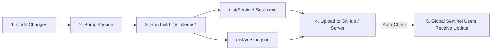

# Sentinel — Release & Global Auto-Update Guide

This guide explains how to release updates for **Sentinel** to users globally and how the automated installer and updater work.

---

## 1. Overview of the Release Pipeline



---

## 2. Releasing a New Version (Step-by-Step)

### Step 1: Bump the Version Number
When you are ready to ship an update (e.g. from `1.0.0` to `1.0.1`):
1. In [`updater.py`](file:///C:/Users/Murilo%20Augusto/.gemini/antigravity/scratch/sentinel/updater.py):
   Change:
   ```python
   APP_VERSION = "1.0.1"
   ```
2. In [`Sentinel.iss`](file:///C:/Users/Murilo%20Augusto/.gemini/antigravity/scratch/sentinel/Sentinel.iss):
   Change:
   ```iss
   #define MyAppVersion "1.0.1"
   ```
3. In [`version.json`](file:///C:/Users/Murilo%20Augusto/.gemini/antigravity/scratch/sentinel/version.json):
   Update version and release notes:
   ```json
   {
     "version": "1.0.1",
     "release_date": "2026-10-02",
     "download_url": "https://github.com/YourUsername/sentinel/releases/latest/download/Sentinel-Setup.exe",
     "release_notes": "Sentinel v1.0.1:\n- Novos recursos e correções de desempenho.",
     "mandatory": false
   }
   ```

---

### Step 2: Build the Installer Package
Open PowerShell in the project directory and run:

```powershell
.\build_installer.ps1
```

This single command automatically:
1. Recompiles the standalone `dist\Sentinel.exe` with PyInstaller.
2. Compiles the modern Windows Setup Wizard `dist\Sentinel-Setup.exe` with Inno Setup.
3. Generates the release manifest `dist\version.json` with file checksums.

---

### Step 3: Publish the Release (Two Options)

#### Option A: GitHub Releases (Recommended & 100% Free)
GitHub Releases provides free global CDN hosting with unlimited bandwidth:
1. Push your repository to GitHub (e.g., `github.com/YourUsername/sentinel`).
2. Go to **Releases** → **Draft a new release**.
3. Tag version: `v1.0.1`.
4. Release title: `Sentinel v1.0.1`.
5. Attach file: Upload `dist\Sentinel-Setup.exe`.
6. Publish Release.

All Sentinel installations worldwide will immediately detect the new release!

#### Option B: Any Web Server / Cloud Storage (Cloudflare R2, AWS S3, VPS)
1. Upload `dist\Sentinel-Setup.exe` and `dist\version.json` to your server (e.g., `https://updates.yourdomain.com/`).
2. Make sure the URL is public and HTTPS.
3. Users' Sentinel apps will query your `version.json` directly.

---

## 3. How the Global Auto-Updater Works for Users

1. **Background Discovery:**
   - 4 seconds after Sentinel launches, a background worker queries the release endpoint.
   - The user interface is completely unaffected (no lag, no freezes).
2. **Notification:**
   - If an update is detected, a clean green banner appears at the top:
     `Nova versão do Sentinel (v1.0.1) disponível! [Atualizar Agora] [X]`
   - Users can also manually check via the menu: `Ajuda (Help) → Verificar Atualizações... (Check for Updates...)`.
3. **Download with Progress:**
   - Clicking **Atualizar Agora** opens the update modal displaying release notes, current vs. new version, and a real-time progress bar with download speed.
4. **Silent Seamless Installation:**
   - When download completes, clicking **Instalar e Reiniciar** launches `Sentinel-Setup.exe /SILENT /NORESTART /CLOSEAPPLICATIONS`.
   - Sentinel gracefully exits, Inno Setup swaps the application files in `%LOCALAPPDATA%\Programs\Sentinel\`, and relaunches Sentinel updated.
5. **Data Protection:**
   - All enrolled facial biometric embeddings (`database.db`), event logs, and settings are stored safely in `%LOCALAPPDATA%\Sentinel\` and are **never deleted or overwritten** during updates.
